# Workforce Absenteeism Risk Prediction Platform


[](https://github.com/ishreya-dev/Workforce-Absenteeism-Risk-Prediction-Platform/actions)


An end-to-end data science platform that predicts excessive-absenteeism risk for
employees, built to demonstrate the full data lifecycle: cloud ingestion, SQL
transformation, statistical modeling in both Python and R, real-time streaming,
containerized deployment, and orchestration — entirely within free-tier / local
infrastructure.

## Why This Project?

This project demonstrates an end-to-end ML engineering workflow rather than
only model development. It covers data ingestion, SQL transformation, model
training, statistical validation in R, REST API deployment, real-time
streaming, containerization, orchestration, and cloud-based prediction
storage — using only free-tier infrastructure.

## Repository Statistics

| Metric | Value |
|---|---|
| Dataset Records | 662 |
| ML Models | 2 |
| REST Endpoints | 2 |
| Kafka Topics | 1 |
| Kubernetes Replicas | 2 |
| Programming Languages | Python, R, SQL |

## Highlights

- ✅ BigQuery cloud data warehouse (raw table + SQL cleaning view)
- ✅ SQL-based data transformation, native to BigQuery
- ✅ Machine learning in Python (logistic regression + gradient boosting benchmark)
- ✅ Independent statistical validation in R (`glm()`, cross-checked against Python)
- ✅ FastAPI REST service (`/predict`, `/health`)
- ✅ Kafka real-time streaming pipeline
- ✅ Dockerized and pushed to Docker Hub
- ✅ Deployed to Kubernetes (2 replicas, readiness/liveness probes)
- ✅ Production-ready scoring pipeline, verified consistent across local / Docker / K8s

## Architecture

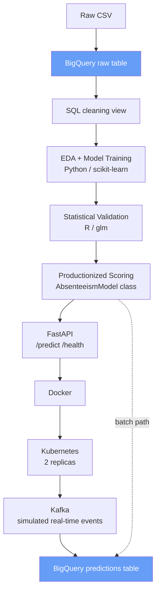

Both the batch pipeline and the real-time Kafka consumer write to a single
shared BigQuery table (`absenteeism_predictions`), distinguished by a `source`
column (`batch` / `streaming`) — a single results table feeding all downstream
reporting, per the original design.

## Tech Stack

| Category | Technology |
|---|---|
| Languages | Python, R, SQL |
| Cloud | Google Cloud Platform — BigQuery (free-tier Sandbox) |
| ML / Data | pandas, numpy, scikit-learn, matplotlib, seaborn |
| Streaming | Apache Kafka (self-hosted via Docker Compose) |
| API | FastAPI |
| Containerization | Docker |
| Orchestration | Kubernetes (Docker Desktop's built-in kind-based cluster) |
| Registry | Docker Hub |

## Dataset

UCI "Absenteeism at Work" dataset — 700 records of absenteeism events at a
courier company in Brazil (2007–2010)
662 rows remain after dropping unknown-reason records (`reason_code = 0`).

Target: `excessive_absenteeism` — binary flag, 1 if an employee's absenteeism
hours exceed the dataset median, 0 otherwise. Target is well-balanced (~52% / 48%).


## Data Schema

The cleaned BigQuery view (`absenteeism_cleaned`) contains the engineered features used for model training and inference.

| Feature | Type | Description |
|----------|------|-------------|
| age | INTEGER | Employee age |
| transportation_expense | INTEGER | Monthly transportation cost |
| distance_to_work | INTEGER | Distance from home to workplace |
| body_mass_index | INTEGER | BMI |
| children | INTEGER | Number of children |
| pets | INTEGER | Number of pets |
| education_binary | INTEGER | 0 = higher education, 1 = otherwise |
| month_value | INTEGER | Month extracted from absence date |
| day_of_week | INTEGER | Weekday extracted from absence date |
| reason_1–reason_4 | INTEGER | One-hot encoded absence reason groups |
| excessive_absenteeism | INTEGER | Target variable (0/1) |

## Repository Structure

```
absenteeism-risk-platform/
│
├──.github/
│   └── workflows/
│       └── ci.yml
├── data/raw/                  # Original CSV (source for the one-time BigQuery load)
├── notebooks/                 # eda.ipynb, modeling.ipynb
├── r/                          # validation.R, statistical_report.md, r_coefficients.csv
├── src/
│   ├── preprocessing/          # feature_config.py
│   ├── model/                  # absenteeism_model.py
│   ├── api/                    # main.py (FastAPI)
│   └── streaming/               # kafka_producer.py, kafka_consumer.py
├── models/                     # model.pkl, scaler.pkl
├── docker/                     # Dockerfile, docker-compose.yml, api-requirements.txt
├── k8s/                        # deployment.yaml, service.yaml, configmap.yaml
├── reports/figures/             # EDA and modeling plots
├── requirements.txt
└── README.md
```

### CI/CD


GitHub Actions automatically validates every push and pull request by:

- Installing dependencies
- Verifying project imports
- Starting the FastAPI application
- Validating the `/health` endpoint
- Building the Docker image


## Running It Locally

**Prerequisites:** Python 3.11+, a GCP project with the BigQuery API
enabled, `gcloud` CLI authenticated (`gcloud auth application-default
login`), Docker Desktop with Kubernetes enabled, a Docker Hub account.

```bash
python -m venv venv
venv\Scripts\activate          # Windows
pip install -r requirements.txt
```

Run the notebooks (`notebooks/eda.ipynb`, `notebooks/modeling.ipynb`) in
order to regenerate the model artifacts in `models/`.

**API, locally:**
```bash
uvicorn src.api.main:app --reload --port 8000
```

**API, in Docker:**
```bash
docker build -t absenteeism-api:1.0 -f docker/Dockerfile .
docker run -p 8000:8000 absenteeism-api:1.0
```

**Streaming layer:**
```bash
docker compose -f docker/docker-compose.yml up
python src/streaming/kafka_producer.py
python src/streaming/kafka_consumer.py
```

**Kubernetes:**
```bash
docker tag absenteeism-api:1.0 <your-dockerhub-username>/absenteeism-api:1.0
docker push <your-dockerhub-username>/absenteeism-api:1.0
# update the image field in k8s/deployment.yaml to match, then:
kubectl apply -f k8s/configmap.yaml
kubectl apply -f k8s/deployment.yaml
kubectl apply -f k8s/service.yaml
kubectl port-forward service/absenteeism-api-service 8000:8000
```

## What's Implemented

- **Cloud foundation** — `absenteeism_raw` table + `absenteeism_cleaned` view in
  BigQuery, replicating the original notebook's preprocessing natively in SQL
  (reason-code grouping, date decomposition, education binarization, median-split target).
- **EDA** (`notebooks/eda.ipynb`) — distributions, correlations, and risk
  breakdowns by reason, age, month, and education — pulled live from BigQuery.
- **Modeling** (`notebooks/modeling.ipynb`) — logistic regression (primary) vs.
  gradient boosting (benchmark). See [Performance Summary](#performance-summary).
- **Statistical validation in R** (`r/validation.R`, `r/statistical_report.md`) —
  independent `glm()` fit cross-checked against the Python model. Every
  significant feature agrees in direction; two genuine discrepancies
  (`reason_2` sign disagreement, `reason_4` collinearity drop) are diagnosed
  and documented as methodological, not modeling, issues.
- **Productionized scoring** (`src/model/absenteeism_model.py`) — `AbsenteeismModel`
  class with `predict`, `predict_proba`, `predict_single`. Reproduces the
  notebook's exact output to 4 decimal places.
- **REST API** (`src/api/main.py`) — FastAPI, `/predict` + `/health`. Verified
  identical predictions locally, in Docker, and in Kubernetes.
- **Real-time streaming** (`src/streaming/`) — Kafka (Zookeeper + broker via
  Docker Compose) simulates incoming events; consumer scores each event with
  the same `AbsenteeismModel` and writes to BigQuery via load jobs (streaming
  inserts aren't available on the free-tier Sandbox).
- **Containerization & orchestration** — Dockerfile → pushed to Docker Hub
  (`ishreyadev/absenteeism-api:1.0`) → deployed to local Kubernetes with 2
  replicas, readiness/liveness probes, verified `Running` via `kubectl port-forward`.

## Results

### Exploratory Data Analysis

| | |
|---|---|
| 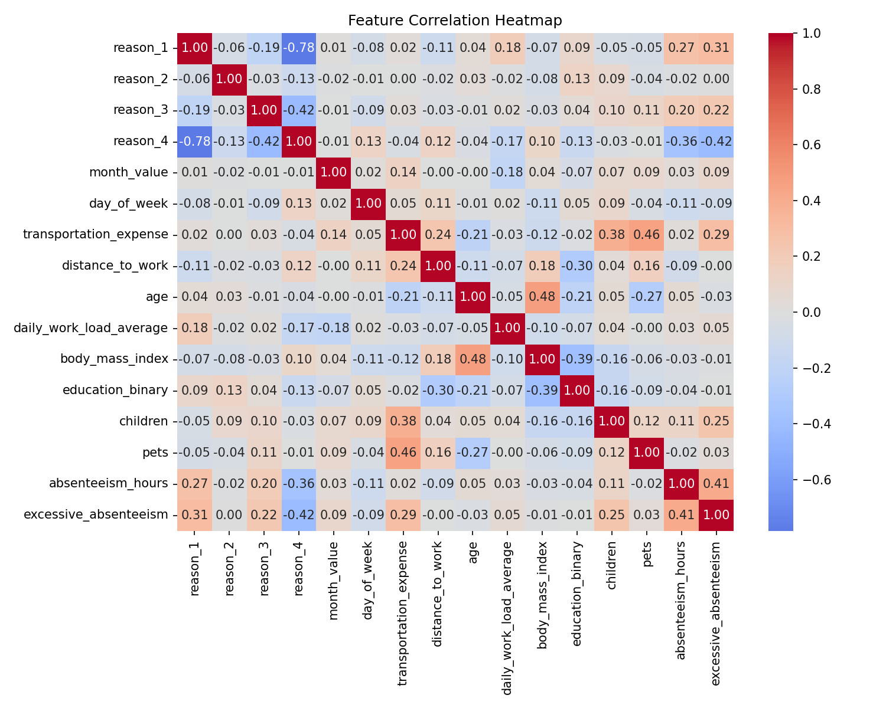 | 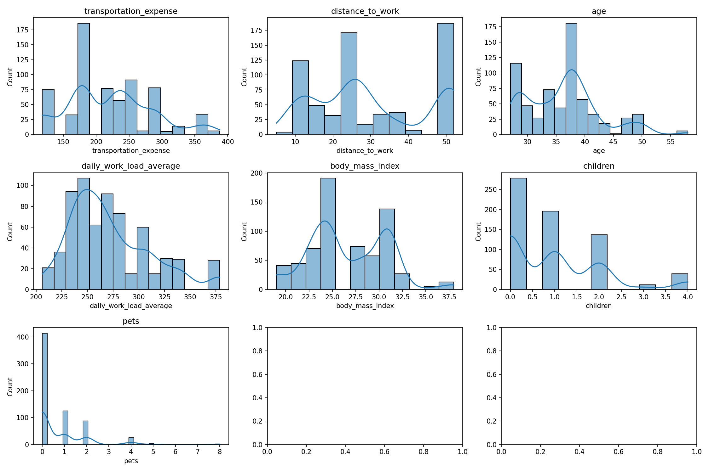 |
| Feature Correlation Heatmap | Feature Distributions |
| 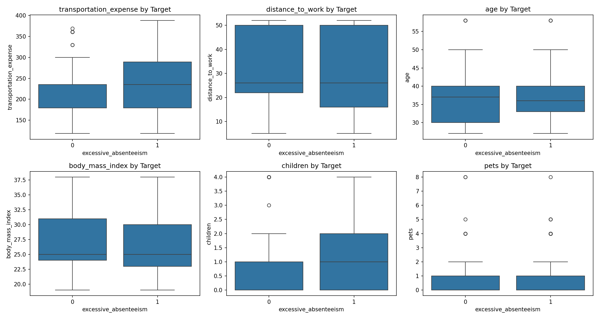 | 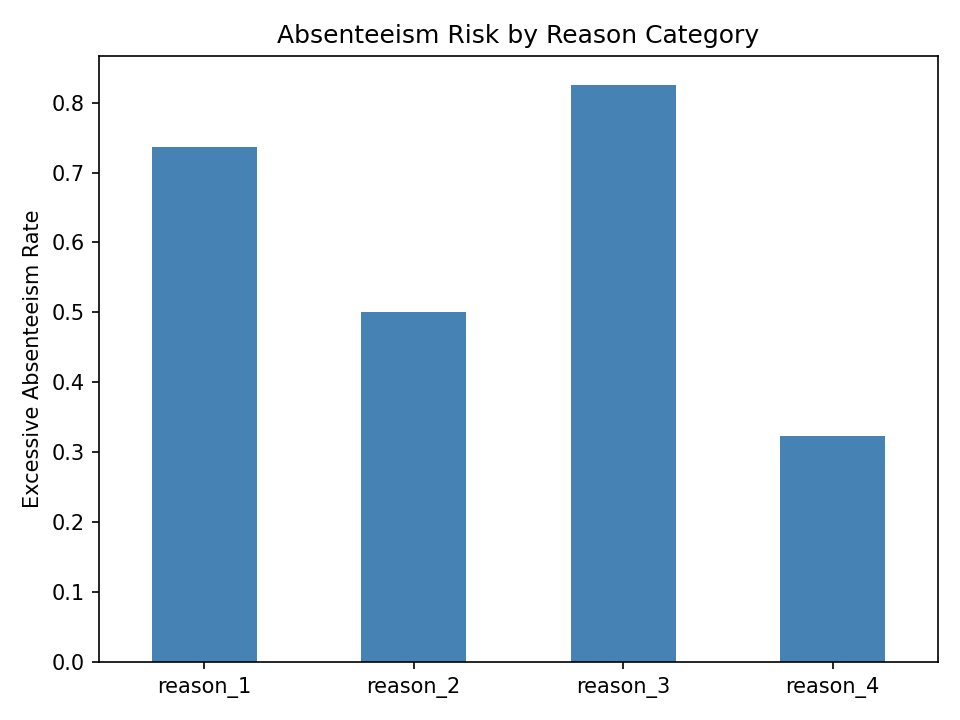 |
| Numerical Features by Target | Absenteeism Risk by Reason Category |
| 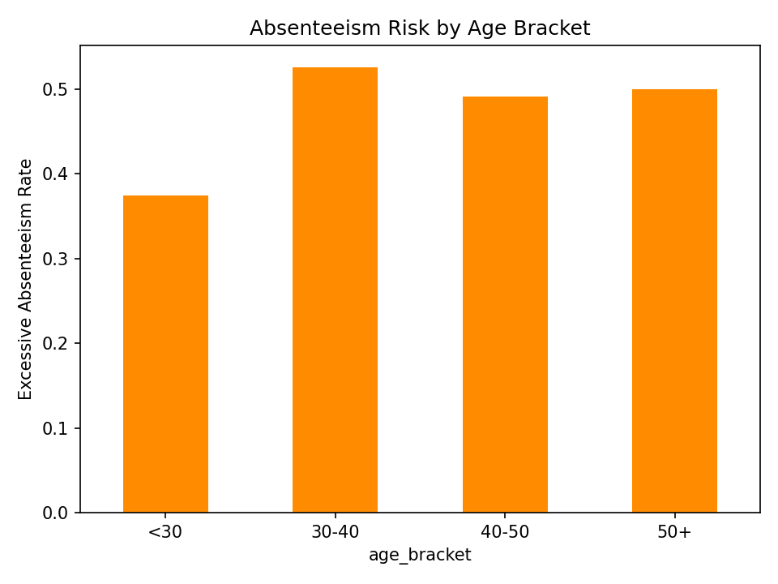 | 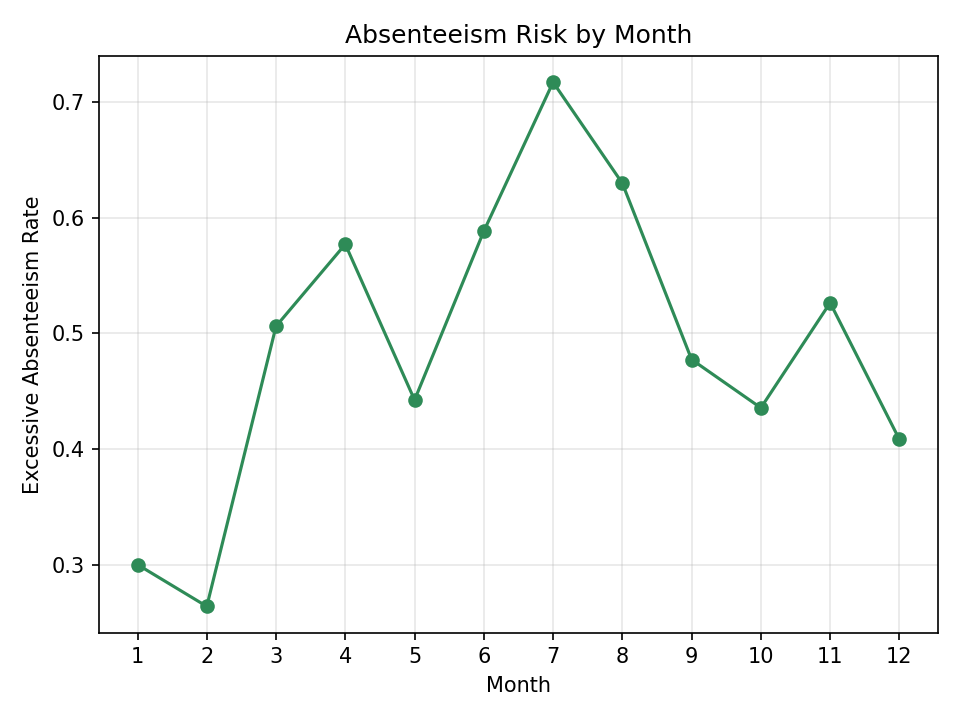 |
| Absenteeism Risk by Age Bracket | Absenteeism Risk by Month |
| 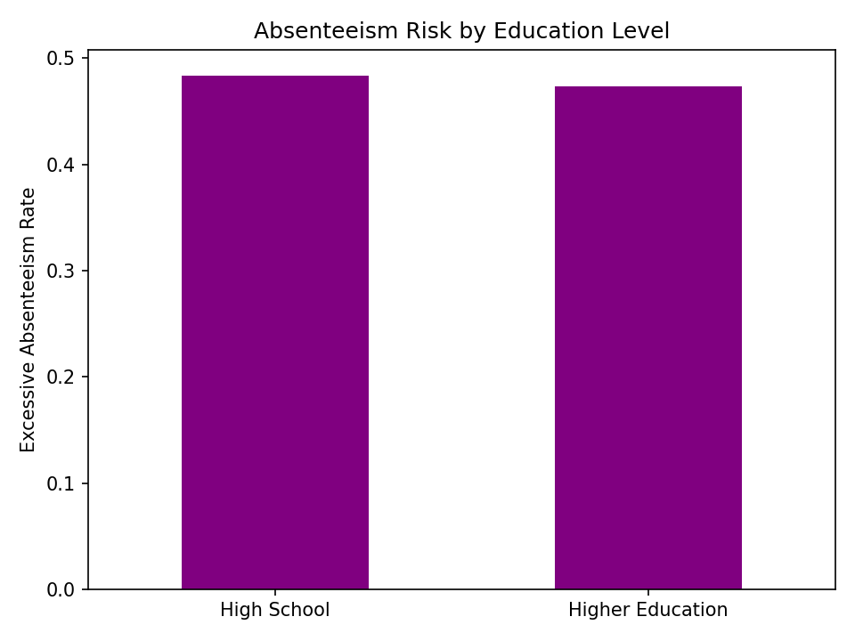 | |
| Absenteeism Risk by Education Level | |

### Modeling

| | |
|---|---|
| 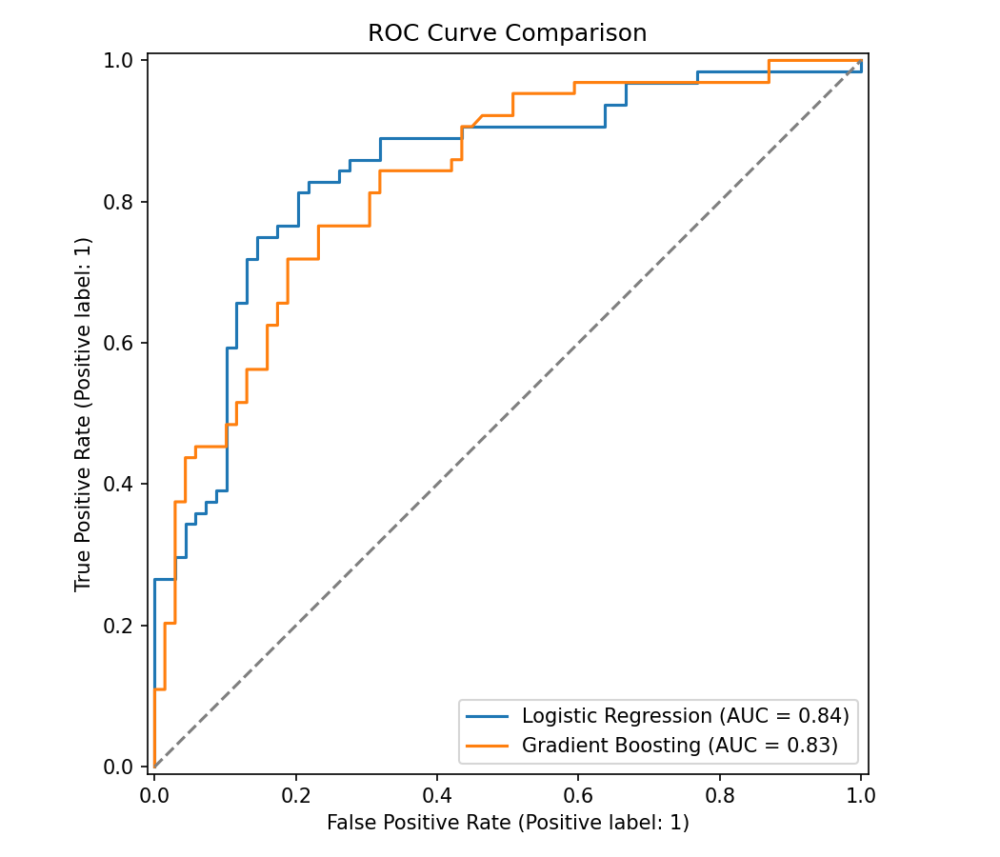 | 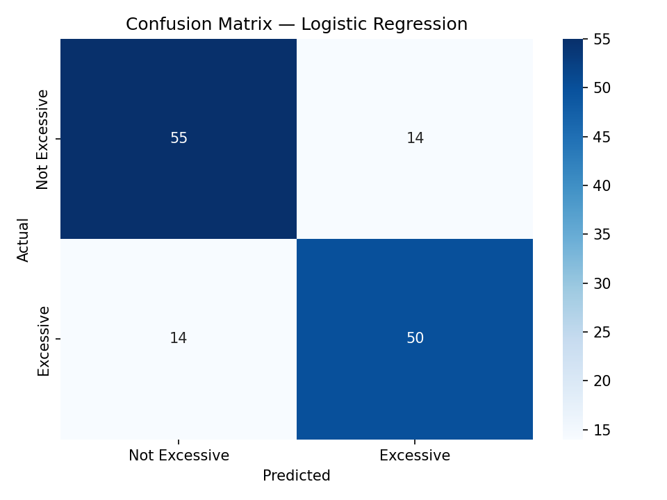 |
| ROC Curve — Logistic Regression vs. Gradient Boosting | Confusion Matrix — Logistic Regression |
| 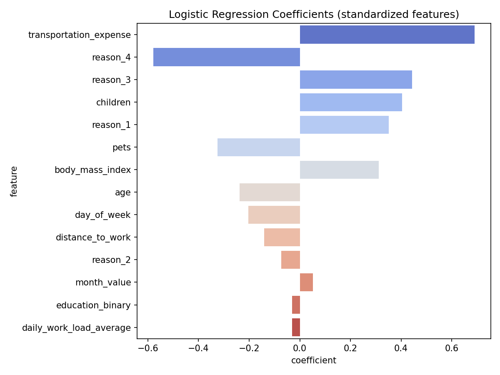 | |
| Standardized Logistic Regression Coefficients | |

### Deployment


## Performance Summary

| Model | ROC-AUC | 5-Fold CV Mean | Status |
|---|---|---|---|
| Logistic Regression | 0.844 | 0.78 (std 0.039) | ✅ Production |
| Gradient Boosting | 0.828 | — | Benchmark |

Gradient boosting slightly underperforms logistic regression here, supporting
the choice of the more interpretable model as primary with no predictive cost.
Top risk drivers (from standardized coefficients): `transportation_expense`,
`reason_4` (protective), `reason_3`, `children`.

## API Example

**Request:**
```bash
curl -X POST http://localhost:8000/predict \
  -H "Content-Type: application/json" \
  -d '{
    "age": 37,
    "children": 2,
    "transportation_expense": 289,
    "distance_to_work": 26,
    "body_mass_index": 25,
    "pets": 1,
    "education_binary": 0,
    "month_value": 7,
    "day_of_week": 3,
    "daily_work_load_average": 271,
    "reason_1": 0,
    "reason_2": 0,
    "reason_3": 1,
    "reason_4": 0
  }'
```

**Response:**
```json
{
  "excessive_absenteeism_risk": 1,
  "risk_probability": 0.847
}
```

## Key Engineering Notes

- BigQuery's `APPROX_QUANTILES` is not supported as an analytic/window
  function — the cleaning view computes the median-split target via a
  separate aggregate subquery cross-joined back to the main table, rather
  than an `OVER ()` clause.
- Local kind-based Kubernetes (via Docker Desktop) does not expose its node
  as a regular Docker container, and `imagePullPolicy: Never` with a
  locally built image is unreliable on this setup — resolved by pushing
  the image to Docker Hub and pulling it like a standard registry image
  (`imagePullPolicy: IfNotPresent`), which is also the more realistic
  production pattern.
- BigQuery Sandbox mode (no billing account) does not support streaming
  inserts — the Kafka consumer uses `load_table_from_json` batch load jobs
  instead, a reasonable adaptation for this infrastructure constraint.

## Future Improvements

- **Dashboard (Power BI)** — Power BI Desktop connected to BigQuery
  successfully via DirectQuery, but the report build was not finished. The
  `absenteeism_predictions` table is fully queryable and dashboard-ready
  for whoever picks this up next.
- **GCS raw-data lake layer** — skipped to avoid linking a GCP billing
  account; the raw CSV is loaded directly into BigQuery via the console's
  upload feature instead. BigQuery runs in free-tier Sandbox mode, with no
  billing account attached.
- **Multi-cloud deployment** — built on GCP only. The architecture
  (BigQuery, Kafka, FastAPI, Docker, Kubernetes) is portable to AWS
  (Redshift/MSK/EKS) or Azure (Synapse/Event Hubs/AKS) equivalents without
  redesign, but was not deployed there.

> Note: the first three items above are deliberate scope decisions
> (documented for transparency, not gaps in execution); Power BI and CI/CD
> are genuinely incomplete and are the actual "next steps."

## Author

**Shreya Kumari**
GitHub: [ishreya-dev](https://github.com/ishreya-dev)
Email: shreya24singhs@gmail.com

## License

MIT

## Acknowledgements

- [UCI Machine Learning Repository](https://archive.ics.uci.edu/) — Absenteeism at Work dataset
- [arkya-art/End-To-End-Data-Science-Project](https://github.com/arkya-art/End-To-End-Data-Science-Project) — original notebook inspiration
